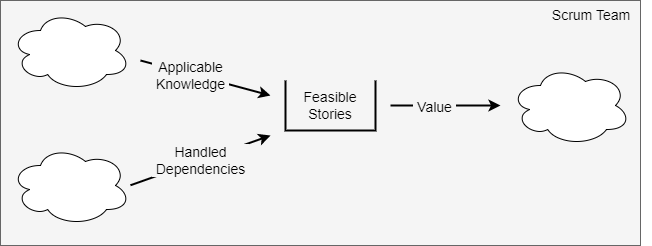

# Scrum Team

A Scrum team creates value by converting each story into a tangible result by
the end of the sprint. The team needs the know-how and the autonomy to produce
this within the given time. In other words, the [system](index.md) of a Scrum
team is a stock of *feasible stories* that has *applicable knowledge* and
*handled dependencies* as inflows and *value* as outflow.

## Applicable Knowledge

The team needs three forms of knowledge. These are context, process and content.
Together they make knowledge applicable to the problem space of the team.

Context - *what is it that brings about value?*

Process - *what are the production steps?*

Content - *what technical tools and concepts will fix the problem?*

## Handled Dependencies

The team needs to move forward unimpeded to produce results within a sprint. All
dependencies need to be handled beforehand. The team can do this with by either
being self-sufficient, or by using external services within its own control.

There is an interplay between self-sufficiency and the content knowledge that
the team needs to maintain for it. The more autonomous the team is, the more
content knowledge it needs to hold.
